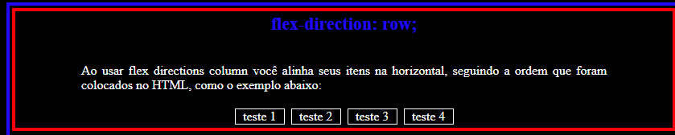

# POC1-Flexbox
Prova de conceito sobre as propriedades Flexbox

 

  

<h1 align="center">POC - Flexbox</h3>

  O objetivo desta prova de conceito é ajudar os usuários a entender e aplicar HTML e CSS, com foco específico em Flexbox, proporcionando uma base sólida para a criação de layouts responsivos e flexíveis.
  

<!-- TABLE OF CONTENTS -->

  
Conteúdo

  <ol>
    <li>
      <a href="#about-the-project">Sobre o Projeto</a>
      <ul>
        <li><a href="#built-with">Construído com</a></li>
      </ul>
    </li>
    <li>
      <ul>
        <li><a href="#prerequisites">Pré-requisitos</a></li>
      </ul>
    </li>
    <li><a href="#usage">Uso</a></li>
    <li><a href="#roadmap">Roadmap</a></li>
    <li><a href="#contact">Contato</a></li>
  </ol>

<!-- ABOUT THE PROJECT -->
## Sobre o Projeto

Este projeto é parte do segundo semestre do curso de Sistemas de Informação do Mackenzie, na disciplina de Web Mobile. Trata-se da primeira prova de conceito, com uma abordagem extensiva que visa ampliar o conhecimento na área e promover um impacto positivo na comunidade. O objetivo é ajudar os usuários a entender e aplicar HTML e CSS, com foco específico em Flexbox, proporcionando uma base sólida para a criação de layouts responsivos e flexíveis.

(<a href="#readme-top">back to top</a>)

### Construído com

 HTML5 e CSS 

(<a href="#readme-top">back to top</a>)

# Pré-requisitos para Começar a Usar Flexbox
### Conhecimento Básico de HTML e CSS

<b> HTML: </b> Entender como estruturar documentos HTML utilizando elementos e atributos.
CSS: Saber como aplicar estilos aos elementos HTML, incluindo o uso de seletores, propriedades e valores.
Conceitos Fundamentais de Layout

<b> Modelo de Caixa (Box Model): </b>  Compreender como as propriedades de largura, altura, padding, borda e margem influenciam o layout dos elementos.
Posicionamento: Ter conhecimento das propriedades de posicionamento, como static, relative, absolute e fixed.
Propriedades CSS Básicas

<b> Display: </b> Estar familiarizado com as propriedades de display, como block, inline, inline-block e none.
Margem e Padding: Entender como margens e preenchimentos afetam o espaço ao redor e dentro dos elementos.
Conhecimento de Layouts Básicos

<b> Layouts de Bloco e Inline: </b>  Saber como os elementos de bloco e inline se comportam e como são exibidos no fluxo do documento.
Navegadores e Ferramentas de Desenvolvimento

<b> Compatibilidade de Navegadores: </b> Estar ciente de que o Flexbox é amplamente suportado pelos navegadores modernos, mas pode haver variações na implementação.
Ferramentas de Desenvolvimento: Utilizar as ferramentas de desenvolvimento dos navegadores para inspecionar e depurar layouts flexíveis.

# Uso
### Flexbox pode ser usado para criar um layout basico onde os itens sao distribuídos uniformemente ao longo do contêiner.

<b> Alinhamento Horizontal: </b>
Alinhe itens horizontalmente ao longo do eixo principal com diferentes opcoes de alinhamento, como centralizado, ao inicio ou ao final.

<b> Alinhamento Vertical: </b>
Alinhe itens verticalmente ao longo do eixo transversal, ajustando a posicao dos itens em relacao ao contêiner. Layout em Colunas e Linhas

Use a propriedade flex-direction para alternar entre layouts em coluna e linha, permitindo organizar os itens verticalmente ou horizontalmente.

<b>Embutir Layouts Flexiveis:</b>
Utilize Flexbox dentro de outros contêineres flexiveis para criar layouts mais complexos e responsivos.

<!-- ROADMAP -->
## Roadmap

- [ ] **Crie um layout basico onde os itens sao distribuídos uniformemente ao longo do contêiner.**  
  *Veja: `display: flex;`*
   

- [ ] **Alinhe itens horizontalmente ao longo do eixo principal com diferentes opcoes de alinhamento, como centralizado(center), ao inicio (start) ou ao final (end).**  
  *Veja: `justify-content: center;`, `justify-content: start;`, `justify-content: end;`*
  
  
  

- [ ] **Alinhe itens verticalmente ao longo do eixo transversal, ajustando a posicao dos itens em relacao ao contêiner no centro (center), ao inicio (start) ou ao final (end)**  
  *Veja: `align-items: center;`, `align-items: start;`, `align-items: end;`*

  
 
  
  
  

  

  
  
  

  

  
  
  

  

  
  
  

  

  
  
  

     
- [ ] **Utilize Flexbox dentro de outros contêineres flexiveis para criar layouts mais complexos e responsivos.**  
  *Veja: `flex-wrap: nowrap;`, `flex-wrap: wrap;`, `flex-wrap: wrap-reverse;`*
    
  - Os itens flexíveis permanecem em uma única linha, sem quebra. Isso pode resultar em overflow se o conteúdo exceder o espaço disponível.   
     
    
    
  - Os itens flexíveis quebram em várias linhas, se necessário, para se ajustarem ao contêiner. As linhas adicionais são dispostas abaixo da linha anterior.   
     
    
   
  - Os itens flexíveis também quebram em várias linhas, mas as linhas adicionais são dispostas acima da linha anterior, invertendo a ordem padrão de empilhamento.   